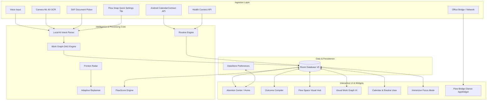
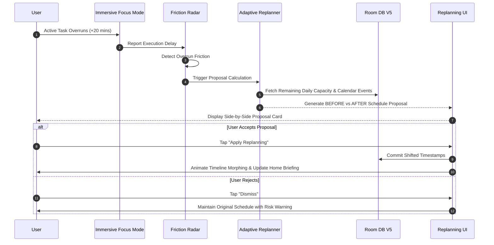
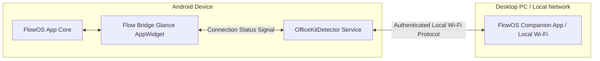

# FlowOS V3 — Personal Adaptive Work OS for Android

> **"Most productivity apps manage tasks. FlowOS manages the outcome."**

FlowOS V3 is an **Adaptive Personal Work OS** built natively for Android. Unlike static task lists or basic calendar utilities, FlowOS understands your work context, predicts focus bottlenecks, compiles messy input into execution DAGs (Directed Acyclic Graphs), dynamically protects fitness and focus time, and adaptively replans your day as reality changes.

---

## 🌟 Flagship Core Loop

```
  ┌──────────┐     ┌───────────┐     ┌───────────┐     ┌───────────┐     ┌───────────┐
  │ CAPTURE  │ ──> │ UNDERSTAND│ ──> │  COMPILE  │ ──> │   GRAPH   │ ──> │   PLAN    │
  └──────────┘     └───────────┘     └───────────┘     └───────────┘     └───────────┘
                                                                               │
  ┌──────────┐     ┌───────────┐     ┌───────────┐     ┌───────────┐           │
  │  SCORE   │ <── │  VERIFY   │ <── │   ADAPT   │ <── │  DETECT   │ <── ──────┘
  └──────────┘     └───────────┘     └───────────┘     └───────────┘
```

1. **CAPTURE**: Multimodal ingestion via Voice, Camera OCR (ML Kit), Storage Access Framework (SAF), and Quick Settings Flow Snap Tile.
2. **UNDERSTAND**: Local AI heuristic parsing isolating core intent, priority, estimated duration, and hard constraints.
3. **COMPILE**: Transforms unstructured inputs into verified `Outcome` entities and structured `TaskNode` execution trees.
4. **GRAPH**: Builds a Directed Acyclic Graph (DAG) visualizing dependencies, critical paths, and downstream impact.
5. **PLAN**: Blends system calendar events, preplanned routines, and focus windows into an optimal timeline.
6. **EXECUTE**: Immersive focus surface with kinetic timers, ambient visual cues, and targeted sensory haptics.
7. **DETECT**: Real-time **Friction Radar** monitoring schedule overruns, routine conflicts, and connectivity drops.
8. **ADAPT**: **Adaptive Replanner** presenting side-by-side **BEFORE vs AFTER** schedule transformation proposals.
9. **VERIFY**: Genuine outcome proof verification requiring photo/document evidence before marking outcomes complete.
10. **SCORE**: Multi-dimensional **FlowScore** evaluating performance across 6 distinct productivity axes.

---

## 🏗 System Architecture & Diagrams

### 1. High-Level Architecture



### 2. Adaptive Replanning & Friction Loop



### 3. Cross-Device Flow Bridge Architecture



---

## 🔥 Key Features & Capabilities

### 1. 🎙 Multimodal Capture & Quick Snap
- **Flow Snap QS Tile**: Instantly capture ideas from anywhere on Android via a system Quick Settings tile without opening the main app.
- **Camera CV / ML Kit OCR**: Photograph paper documents, whiteboards, or physical notices. ML Kit automatically extracts text, dates, and action items on-device.
- **Storage Access Framework (SAF)**: Securely attach native files and documents with persistent URI permissions.

### 2. 🧠 Intent Compiler & Visual Work Graph
- **Outcome Compilation**: Converts loose thoughts into structured `Outcome` entities complete with target deadlines and child tasks.
- **Directed Acyclic Graph (DAG)**: Visualizes node dependencies, isolates critical path bottlenecks, and displays downstream task impacts.

### 3. 📅 Calendar & Capacity Intelligence
- **System Calendar Integration**: Real-time two-way synchronization via Android `CalendarContract`.
- **Adaptive Capacity Modeling**: Automatically subtracts fixed commitments and calculates actual available focus minutes.

### 4. 🏋️ Preplanned Routines & Health Connect
- **Routine Engine**: Prebuilt, customizable day templates (**College Day**, **Exam Day**, **Project Day**, **Deep Work Day**, **Fitness Day**).
- **Conflict Engine**: Detects overlaps between preplanned routines and incoming system calendar events.
- **Health Connect Integration**: Syncs step counts, active calories, workout sessions, and distance. Automatically flags workouts as **PROTECTED FITNESS TIME** to safeguard personal health windows.

### 5. ⚡ Friction Radar & Adaptive Replanner
- **Real-Time Friction Radar**: Monitors schedule overruns, routine conflicts, and desktop disconnects.
- **BEFORE vs AFTER Proposal Engine**: Displays exact side-by-side timeline modifications when delays occur, allowing 1-tap schedule adjustment.

### 6. 💻 Flow Bridge & Glance AppWidget
- **Flow Bridge AppWidget**: Android `androidx.glance` desktop widget indicating live PC connection state (`● PC CONNECTED` / `PC NOT CONNECTED`).
- **Office Bridge**: Seamless local Wi-Fi pairing for cross-device file transfer and task handoff.

### 7. ⏱ Immersive Focus Mode & Evidence Proof
- **Kinetic Timer**: Minimalist high-contrast focus surface with ambient color cues.
- **Verified Outcomes**: Enforces proof verification (capturing photo or selecting output file) before marking critical outcomes as completed.

### 8. 📊 6-Dimensional FlowScore Engine
Evaluates daily productivity across six weighted metrics:
- **Progress**: Percentage of planned outcomes completed.
- **Efficiency**: Ratio of estimated task duration vs actual execution time.
- **Reliability**: Adherence to planned time windows.
- **Recovery**: Preservation of protected fitness and rest time.
- **Focus**: Continuous uninterrupted execution time.
- **Velocity**: Rate of high-priority task completion.

---

## 🎨 Design System & Visual Tokens

FlowOS V3 features a flagship visual language crafted for AMOLED displays and high refresh rate screens:

| Design System Dimension | Specification |
|---|---|
| **Primary Theme Palette (Dark)** | AMOLED Deep Black (`#070707`), Card Surface (`#161B22`), Slate Dark (`#0D1117`) |
| **Primary Theme Palette (Light)** | Crisp Slate (`#F8FAFC`), Surface White (`#FFFFFF`), Text Slate (`#0F172A`) |
| **Signature Accent** | Kinetic Yellow (`#FFD400`) & Electric Amber (`#FFAB00`) |
| **Dynamic Theme Modes** | `SYSTEM_DEFAULT` (auto dark/light), `LIGHT`, `DARK` stored in DataStore |
| **Typography** | Modern sans-serif hierarchy built on Material 3 design scales |
| **Haptic Feedback** | Custom haptic tick patterns for intent capture, focus state changes, and completion |

---

## 🛠 Tech Stack & Technical Specifications

- **Language**: Kotlin 2.0+
- **UI Framework**: Jetpack Compose (Material 3, Compose Navigation)
- **AppWidget Framework**: AndroidX Glance (`androidx.glance:glance-appwidget:1.1.1`)
- **Async Execution**: Kotlin Coroutines & StateFlow / SharedFlow
- **Local Database**: Room DB V5 (`androidx.room`) with KSP annotation processing
- **Preferences**: DataStore Preferences (`androidx.datastore`)
- **Camera & Vision**: CameraX (`androidx.camera`) + Google ML Kit Text Recognition (`com.google.mlkit:text-recognition`)
- **Fitness & Context**: Android Health Connect SDK (`androidx.health.connect:connect-client`)
- **System Integration**: `android.provider.CalendarContract`, `Storage Access Framework (SAF)`, `android.service.quicksettings.TileService`
- **Build System**: Gradle 8.x with Kotlin DSL (`build.gradle.kts`)
- **Target SDK**: 34 (Android 14)
- **Compile SDK**: 35 (Android 15)
- **Minimum SDK**: 26 (Android 8.0 Oreo)
- **JVM Compatibility**: Java 17 (JDK 21 compatible)

---

## 📁 Package Architecture

```
com.flowos.app/
├── MainActivity.kt                # Main entry Activity with dynamic theme binding
├── FlowOSApplication.kt           # Application instance & dependency graph
├── action/                        # Immersive focus timer & outcome proof verification
├── ai/                            # On-device ML Kit OCR & local heuristic intent parser
├── calendar/                      # System CalendarContract ingestion & capacity solver
├── capture/                       # Multimodal capture, SAF document integration, QS Tile
├── context/                       # Health Connect manager (steps, workouts, protected fitness)
├── crossdevice/                   # Office Bridge network protocol & Glance AppWidget
├── data/                          # Room DB V5 entities, DAOs, and repositories
├── di/                            # Dependency injection containers & providers
├── domain/                        # Domain models, outcome trees, task nodes
├── notifications/                 # System alerts & focus notification manager
├── planner/                       # RoutineEngine (templates) & AdaptiveReplanner
├── pulse/                         # FrictionRadar & real-time execution monitoring
├── scoring/                       # 6-Dimensional FlowScore calculation engine
├── settings/                      # SettingsStore & ThemeMode preferences
├── ui/                            # Jetpack Compose UI components, screens, theme tokens
└── workflow/                      # Directed Acyclic Graph (DAG) WorkGraph solver
```

---

## 🚀 Getting Started & Build Guide

### Prerequisites
- **JDK 21** or **JDK 17** installed and configured in `JAVA_HOME`.
- **Android Studio Jellyfish / Ladybug** (or Command Line Tools).
- **Physical Android Device** running Android 8.0 (API 26) or higher.

### 1. Build Debug APK
```powershell
# Set JAVA_HOME (Windows example)
$env:JAVA_HOME="C:\Program Files\Java\jdk-21"

# Assemble Debug APK
.\gradlew.bat assembleDebug
```
The output APK will be generated at `app/build/outputs/apk/debug/app-debug.apk`.

### 2. Run Automated Test Suite
```powershell
# Run all 55 unit tests
.\gradlew.bat test --continue
```

### 3. Deploy to Physical Device
```powershell
# Install APK via ADB
adb install -r app/build/outputs/apk/debug/app-debug.apk
```

---

## 🧪 Testing & Quality Assurance

FlowOS V3 maintains strict quality controls:

- **Automated Unit Tests**: **55/55 PASSING** covering `RoutineEngine`, `FrictionRadar`, `FlowScoreEngine`, `AdaptiveReplanner`, and Room DB migrations.
- **System API Matrix**: Verified against real Android `CalendarContract`, `HealthConnectClient`, `MLKit TextRecognition`, and `QuickSettings TileService`.
- **Manual Verification Matrix**: 40 comprehensive device verification scenarios documented in [`FLOWOS_MANUAL_VERIFICATION_GUIDE.md`](file:///c:/tempp/projects/Flow/FLOWOS_MANUAL_VERIFICATION_GUIDE.md).

---

## 🔒 Privacy & Data Sovereignty

- **100% On-Device Execution**: All processing (Local AI heuristic parsing, OCR, calendar indexing, routine conflict math) occurs strictly on your device.
- **Zero Cloud Dependencies**: FlowOS operates completely offline without mandatory accounts, external trackers, or cloud storage sync.
- **Granular Permissions**: System calendar, health data, and camera access are requested strictly on-demand with transparent rationale screens.

---

Designed for the flagship mobile experience.  
**FlowOS V3 — Manage the outcome.**
